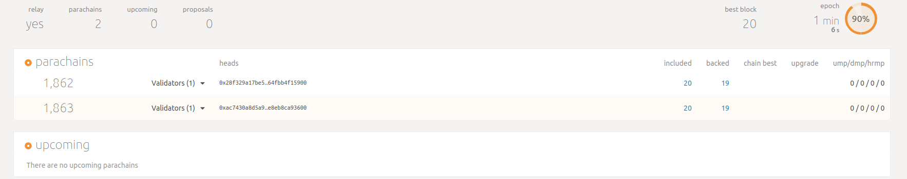
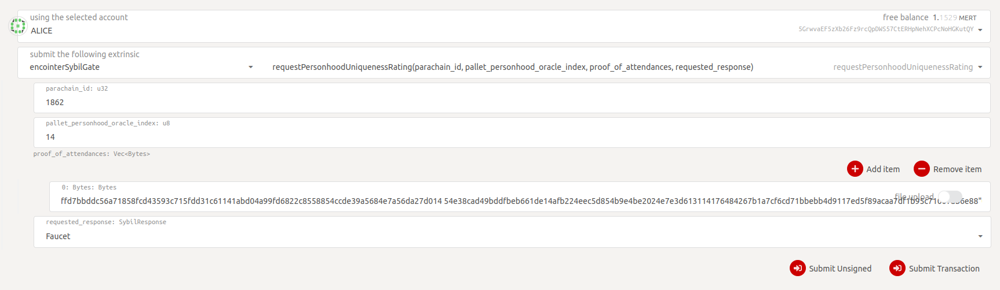

# Encointer Parachain:

This is the repository to run encointer as a parachain in the rococo-v1 testnet. It is forked from the [Cumulus](https://github.com/paritytech/cumulus) repository and only adds the encointer-pallets and configuration.

## Launch a local setup including a Relay Chain and a Parachain

### Launch the Relay Chain (Local Rococo Testnet)

```bash
# Compile Polkadot with the real overseer feature
git clone https://github.com/paritytech/polkadot
git fetch
git checkout 70afaae2cfa279c9cd80e897c76eb5c2386ee017
cargo build --release

# Generate a raw chain spec
./target/release/polkadot build-spec --chain rococo-local --disable-default-bootnode --raw > rococo-local-cfde.json

# Alice
./target/release/polkadot --chain rococo-local-cfde.json --alice --tmp

# Bob (In a separate terminal)
./target/release/polkadot --chain rococo-local-cfde.json --bob --tmp --port 30334
```

### Launch the Parachain

```bash
# Compile
git clone https://github.com/encointer/encointer-parachain.git
git checkout master
cargo build --release

# Export genesis state
# --parachain-id 1862 as an example that can be chosen freely. Make sure to everywhere use the same parachain id
./target/release/encointer-collator export-genesis-state --chain encointer-local --parachain-id 1862 > encointer-local-genesis.state

# Export genesis wasm
./target/release/encointer-collator export-genesis-wasm --chain encointer-local > encointer-local-genesis.wasm

# Collator
./target/release/encointer-collator --collator --tmp --parachain-id 1862 --chain encointer-local --port 40335 --ws-port 9946 -- --execution wasm --chain ../polkadot/rococo-local-cfde-real-overseer.json --port 30337 --ws-port 9981
```

### Register the Parachain
Go to [Polkadot Apps](https://polkadot.js.org/apps/) connect to the default local port (Alice) and register the parachain via the `paraSudoWrapper` pallet. After registering, the collator should start producing blocks when the next era starts.

**Note:** Change the `ParaId` to 1862 when registering the parachain.


### Test Encointer Client
```bash
git clone https://github.com/encointer/encointer-node.git
cargo build --release
./target/release/encointer-client-notee -p 9946 get-phase
# should print the phase
./target/release/encointer-client-notee -p 9946 next-phase
# should progress phase
```

### Deploy on rococo

Prepare genesis state and wasm as follows:

```bash
# Export genesis state
# --parachain-id 1862 as an example that can be chosen freely. Make sure to everywhere use the same parachain id
./target/release/encointer-collator export-genesis-state --chain encointer-rococo --parachain-id 1862 > encointer-rococo-genesis.state

# Export genesis wasm
./target/release/encointer-collator export-genesis-wasm --chain encointer-rococo > encointer-rococo-genesis.wasm

```
then propose the parachain on rococo relay-chain

run collator
```
encointer-collator \
        --collator \
        --chain encointer-rococo \
        --parachain-id 1862 \
        --rpc-cors all \
        --name encointer-rococo-collator-1 \
        -- --execution wasm --chain rococo 

```

### Caveats
* Don't forget to enable file upload if you perform drag and drop for the `genesisHead` and `validationCode`. If it is not enabled, Polkadot-js will interpret the path as a string and won't complain but the registration will fail.
* Don't forget to add the argument `--chain encointer-rococo` for the custom chain config. This argument is omitted in the [Cumulus Workshop](https://substrate.dev/cumulus-workshop/).
* The relay chain and the collator need to be about equally recent. This might require frequent rebasing of this repository on the `rococo-v1` branch.
* Sanity check: The genesis state is printed when starting the collator. Make sure it matches the one from the `genesis.state` file.

### Setup local testnet with polkadot-launch
[polkadot-launch](https://github.com/paritytech/polkadot-launch) lets you easily setup a local testnet. The following procedure will setup a local testnet with three relay chain nodes and two encointer parachains. It will also setup up a XCM (cross chain messaging) channel between the two chains.

**Note 2:** The `polkadot-launch-config.json` and the commands below assume that the polkadot-launch directory is on the same level as this repo's directory.

**Preliminaries:** you need to have yarn and node installed

```bash
# We need to build it from source. The one from the yarn registry does not work with our code.
git clone https://github.com/paritytech/polkadot-launch
cd plolkadot-launch
yarn install
yarn build

# In the root directory of this repository simply execute
node ../polkadot-launch/dist/index.js polkadot-launch-config.json
```

This launches the local testnet and creates 5 log files: `alice.log`, `bob.log`, `charlie.log`, which are the logs of the relay chain nodes and `1862.log`, `1863.log`, which are the logs of the two parachains.

# Sybil Gate Demo
Encointer parachain features sybil-defense mechanisms by providing a `personhood-oracle`, which returns a rating of an account's personhood uniqueness. This personhood uniqueness rating is based on the attendance of the regular encointer ceremonies.

The encointer parachain also features a `sybil-gate-template`, which shows how to interact with the `personhood-oracle` from another parachain. This section explains the interaction of the `sybil-gate-template` with the `personhood-oracle` via the polkadot-ui. It is a little bit involved, hence we will provide a docker container soon.

* Launch the network with polkadot-launch as explained in the previous section.
* Run the `bootscript_demo_community.sh` from the encointer-node repository.
* After the script has finished, run the following command in the encointer-node repository, which will return a hex-encoded proof of attendance for Alice: `./target/release/encointer-client-notee get-proof-of-attendance --cid 41eSfKJrhrR6CYxPfUbwAN18R77WbxXoViRWQMAF4hJB //Alice -1`

This was the preliminaries. Now we head to the polkadot-ui to perform the xcm. We open three tabs in the browser with the polkadot-ui.

The first one should be connected to port `9988`, which is the rococo relay chain. There we can check whether the parachains have successfully connected to the relay chain and if they are producing blocks.



The second and third tab should be connected to port `9944` and `9955`, which are the ports of the two parachains with `para_id` = `1862` and `1863` respectively.

In parachain `1863` we go to extrinsics, choose the `encointer-sybil-template` pallet and send our request to the `personhood-oracle` of the other parachain. If successful, we should see a `PersonhoodUniquenessRatingRequestSentSuccess` event in the explorer.



Note: `pallet_personhood_oracle_index` is the pallet's module index in the encointer-parachain runtime. It is currently hardcoded to 14.

In the other tab connected to parachain `1862` we don't need to do anything, but we can observe in the explorer if the request has been handled successfully by our `personhood-oracle`.


Shortly after the request was handled successfully by the other parachain, we should see the following events thrown by parachain `1862`.


Doing the same again, will result in a failure, as each account can be funded only once.


# Type Extensions for Polkadot-UI
```
{
  "Address": "MultiAddress",
  "LookupSource": "MultiAddress",
  "CeremonyPhaseType": {
    "_enum": [
      "Registering",
      "Assigning",
      "Attesting"
    ]
  },
  "ShopIdentifier": "Text",
  "ArticleIdentifier": "Text",
  "CeremonyIndexType": "u32",
  "ParticipantIndexType": "u64",
  "MeetupIndexType": "u64",
  "AttestationIndexType": "u64",
  "CommunityIdentifier": "Hash",
  "BalanceType": "i128",
  "BalanceEntry": {
    "principal": "i128",
    "last_update": "BlockNumber"
  },
  "CommunityCeremony": "(CommunityIdentifier,CeremonyIndexType)",
  "CommunityPropertiesType": {
    "name_utf8": "Vec<u8>",
    "demurrage_per_block": "Demurrage"
  },
  "Demurrage": "i128",
  "Location": {
    "lat": "i64",
    "lon": "i64"
  },
  "Reputation": {
    "_enum": [
      "Unverified",
      "UnverifiedReputable",
      "VerifiedUnlinked",
      "VerifiedLinked"
    ]
  },
  "ClaimOfAttendance": {
    "claimant_public": "AccountId",
    "ceremony_index": "CeremonyIndexType",
    "community_identifier": "CommunityIdentifier",
    "meetup_index": "MeetupIndexType",
    "location": "Location",
    "timestamp": "Moment",
    "number_of_participants_confirmed": "u32"
  },
  "Attestation": {
    "claim": "ClaimOfAttendance",
    "signature": "MultiSignature",
    "public": "AccountId"
  },
  "ProofOfAttendance": {
    "prover_public": "AccountId",
    "ceremony_index": "CeremonyIndexType",
    "community_identifier": "CommunityIdentifier",
    "attendee_public": "AccountId",
    "attendee_signature": "MultiSignature"
  },
  "ShardIdentifier": "Hash",
  "Request": {
    "shard": "ShardIdentifier",
    "cyphertext": "Vec<u8>"
  },
  "Enclave": {
    "pubkey": "AccountId",
    "mrenclave": "Hash",
    "timestamp": "u64",
    "url": "Text"
  },
  "PersonhoodUniquenessRating": "Vec<u8>",
  "SybilResponse": {
    "_enum": [
      "Unused",
      "Faucet"
    ]
  }
}
```

### More Resources
* Thorough Readme about Rococo and Collators in general in the original [repository](https://github.com/paritytech/cumulus) of this fork.
* Parachains on Rococo in the [Polkadot Wiki](https://wiki.polkadot.network/docs/en/build-parachains-rococo#rococo-v1-parachain-requirements)
