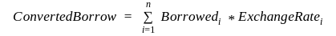
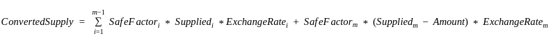
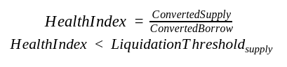
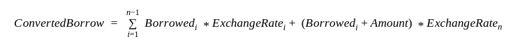
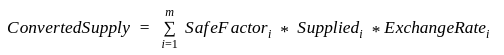
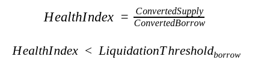
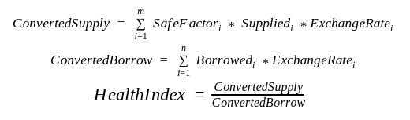
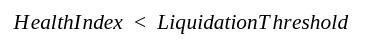
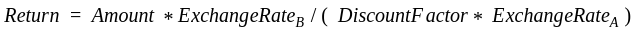

# Konomi node

A substrate based node for DeFi innovation.

## Main Processes
### Supply Asset
The user can choose to supply the certain currency to the allowed pool.

In Konomi, Internally, the system would update user supply interest, pool supply interest. To calculate the interest, there are many models that one can use. The current model is as follows:

When user supplies certain amount, the interest rate is determined at time of deposit with the following equation:
```
UtilizationRatio = TotalBorrow / TotalSupply
SupplyingInterestRate = BorrowingInterestRate * UtilizationRatio
```
You can see that the `SupplyingInterestRate` is derived from `BorrowingInterestRate`. This is because if there are no one paying the interest from borrowing, then there is no interest for supplying. The derivation of `BorrowingInterestRate` is mentioned below.

To ensure the overall safety of the system, if the protocol deemed certain transaction invalid, it would reject the transaction. The system would reject the if the amount is more than the amount owned by the user.

Once all the checks are passed, the protocol would transfer the asset amount from user to the pool.

To calculate the user interest at the current time, conceptually, we are performing as follows:
```json
# At the current block, the interest would be
Interest = InterestRate * TotalUserSupply * (CurrentBlockNumber - LastUpdatedBlockNumber)
```
The interest is basically the amount of interest that has been accumulated since the last update time. `InterestRate` is the current interest rate mentioned above. Please note that, the interest rates are converted to per block.

### Withdraw Assets
To withdraw assets, the system would perform several checks to ensure the validity of the attempted transaction.

If the asset withdrawn is not one of the account's collateral, the amount withdrawn should not be more than that of amount supplied plus total interest earned. Otherwise, the transaction would be rejected.

If the asset is one of the account's collateral, the system would ensure liquidation process would not be triggered.

Liquidation would be triggered if the total collateral valuation in USD is fewer than a certain threshold of the total borrowed in USD. The detailed process is described as followed:

where in the above, `Borrowedi` refers to amount borrowed with interest for each asset, `ExchangeRatei` is the exchange rate of the i-th asset to USD. Equivalently, we can refer to is as the `price` of the asset. Here we use the convention of `ExchangeRate`.



To calculate the amount left after the withdraw would be:



where in the above, `Suppliedi` refers to amount supply with interest for each asset, `Amount` refers to amount to withdraw for a specific asset. `ExchangeRatei` is the exchange rate of the i-th asset. `SafeFactori` is used to model certain reserve for liquidation, its value is between (0, 1).

If the following is reached, then the transaction would be rejected.



After that, the asset would be transferred from the pool to user account. And the amount withdraw would deducted from the asset pool.

### Borrow Asset

The user must have chosen the collateral and supply to the collateral before making borrow requests. To calculate the interest, there are many models that one can use. The current model is as follows:

When user supplies certain amount, the interest will start as of the current day.  The interest rate is determined at time of deposit with the following equation:

```
UtilizationRatio = TotalBorrow / TotalSupply
BowrrowingInterestRate = InitialInterestRate + UtilizationRatio * UtilizationFactor

Interest = InterestRate * TotalUserBorrow * (CurrentBlockNumber - LastUpdatedBlockNumber)
```
Here, `InitialInterestRate` is the starting interest rate when there are no borrow from the pool. `BowrrowingInterestRate` referes to the current time borrow interest rate. `UtilizationFactor` is a constant multiplier for the utilization ratio. 

The choice of `InitialInterestRate`, `UtilizationFactor` are described in section 3 of https://medium.com/konomi/in-depth-analysis-of-konomi-collateral-and-liquidation-model-e81fb885f8bb.

The value of the parameters can be updated during runtime, but only admin is allowed to perform the updates. You can refer to the pallet `FloatingRateLend` for the admin related operations.

To calculate the amount need for collateral is:



where in the above, `Borrowedi` refers to amount with interest borrowed for each asset, `ExchangeRatei` is the exchange rate of the i-th asset and `Amount` is the amount to borrow for that particular asset.

To calculate the current amount of collateral is:



where in the above, `Suppliedi` refers to amount with interest supply for each asset. `ExchangeRatei` is the exchange rate of the i-th asset. `SafeFactori` is used to model certain reserve for liquidation.

If the following is reached, then the transaction would be rejected.



Once all the checks are passed, the protocol would transfer the asset amount from user to the pool.

### Repay Asset

To repay assets, the system would update the interest as shown above. At the same time, if the amount repay is more than that the user owns, the transaction would be rejected.

After that, the asset would be transferred from user account to the pool.

### Liquidation
Liquidation will be triggered when the total supply is lower than the total borrowed, specifically in the following equation:



When the following condition is reached, the account would be marked as `Liquidable`. Arbitrageurs would be able liquidate the account.



The current value of `LiquidationThreshold` is 1. Konomi will provide an API for arbitrageurs to list the `HealthIndex` of all the account in ascending order. In each of the entry, arbitrageurs would be able to see the asset the account has borrowed.

### Arbitrage
Arbitrageurs would be able to supply to the borrowed asset pool of the liquidated account. For every single transaction, the arbitrageurs can only purchase up to `CloseFactor` of the assets. The current value is 1. If this `CloseFactor` is less than one and the total evaluation is less than 100 USD, the Arbitrageurs can purchase all the collateral.

**When arbitrageurs purchase from the liquidated account, the amount paid would be deducted from the liquidated account's asset borrowed and would go back to the pool of the asset. The equivalent amount of the collateral would be transferred from the liquidated account to the Konomi's account.**

To provide the context, assume the liquidated account used asset A as collateral and borrowed B asset. Arbitrageurs could provide B and get A in return. The collateral returned to the arbitrageurs are calculated as follows:



where in the about, `Amount` refers to the amount supplied by arbitrageurs. `ExchangeRateB` is the exchange rate to USD of the borrowed asset. `DiscountFactor` is a number in the range of (0, 1), but now`DiscountFactor` is 0.95,it refers to an incentive for extra collateral returns to the arbitrageurs. `ExchangeRateA` is the exchange rate from USD to A.

## Pallets
- assets: asset for swap and lending

## Local Development

Follow these steps to prepare a local Substrate development environment:

### Simple Setup

Install all the required dependencies with a single command (be patient, this can take up to 30
minutes).

```bash
curl https://getsubstrate.io -sSf | bash -s -- --fast
```

### Build
To build the parachain, use the command: `cargo build --release`.


### Run
#### Relay Chain
Start the relay chain as follows:
```bash
# Compile Polkadot with the real overseer feature
git clone https://github.com/paritytech/polkadot
git fetch
git checkout rococo-v1
cargo build --release

# Generate a raw chain spec
./target/release/polkadot build-spec --chain rococo-local --disable-default-bootnode --raw > rococo-local-cfde.json

# Alice
./target/release/polkadot --chain rococo-local-cfde.json --alice --tmp

# Bob (In a separate terminal)
./target/release/polkadot --chain rococo-local-cfde.json --bob --tmp --port 30334
```

Start the collators
```bash
cargo update -p jsonrpsee-utils --precise 0.2.0-alpha.6 && cargo update -p jsonrpsee-types --precise 0.2.0-alpha.6

# Collator1
./target/release/polkadot-collator --collator --tmp --alice --force-authoring --parachain-id 18403 --port 40335 --ws-port 9946 --rpc-methods Unsafe --ws-external --rpc-cors all -- --execution wasm --chain ../polkadot/rococo-local-cfde.json --port 30335

# Collator2
./target/release/polkadot-collator --collator --tmp --bob --force-authoring --parachain-id 18403 --port 40336 --ws-port 9947 --rpc-methods Unsafe --ws-external --rpc-cors all -- --execution wasm --chain ../polkadot/rococo-local-cfde.json --port 30336

# Parachain Full Node 1
./target/release/polkadot-collator --tmp --parachain-id 18403 --port 40337 --ws-port 9948 --rpc-port 9929 --rpc-methods Unsafe --ws-external --rpc-cors all -- --execution wasm --chain ../polkadot/rococo-local-cfde.json --port 30337

./target/release/polkadot-collator export-genesis-state --parachain-id 18403 > genesis-state-18403
./target/release/polkadot-collator export-genesis-wasm > genesis-wasm-18403
```
If you encounter json error in building, try:
```shell
cargo update -p jsonrpsee-utils --precise 0.2.0-alpha.6 && cargo update -p jsonrpsee-types --precise 0.2.0-alpha.6

docker build -t konominetwork/parachain:v0.1.0 .
```
