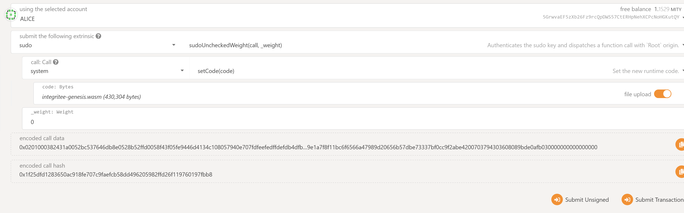

# IntegriTEE Parachain:

This is the repository to run integritee as a parachain in the rococo-v1 testnet. It is forked from the [Cumulus](https://github.com/paritytech/cumulus) repository and only adds the SubstraTEE pallet and configuration.

## Launch a local setup including a Relay Chain and a Parachain

### Launch the Relay Chain (Local Rococo Testnet)

```bash
# Compile Polkadot with the real overseer feature
git clone https://github.com/paritytech/polkadot
git checkout rococo-v1
cargo build --release --features=real-overseer

# Generate a raw chain spec
./target/release/polkadot build-spec --chain rococo-local --disable-default-bootnode --raw > rococo-local-cfde-real-overseer.json

# Alice
./target/release/polkadot --chain rococo-local-cfde-real-overseer.json --alice --tmp

# Bob (In a separate terminal)
./target/release/polkadot --chain rococo-local-cfde-real-overseer.json --bob --tmp --port 30334
```

### Launch the Parachain

```bash
# Compile
git clone https://github.com/scs/integritee-parachain.git
git checkout master
cargo build --release

# Export genesis state
# --parachain-id 1983 as an example that can be chosen freely. Make sure to everywhere use the same parachain id
./target/release/integritee-collator export-genesis-state --chain integritee-local --parachain-id 1983 > integritee-local-genesis.state

# Export genesis wasm
./target/release/integritee-collator export-genesis-wasm --chain integritee-local > integritee-local-genesis.wasm

# Collator
./target/release/integritee-collator --collator --tmp --parachain-id 1983 --chain integritee-local --port 40335 --ws-port 9946 -- --execution wasm --chain ../polkadot/rococo-local-cfde-real-overseer.json --port 30337 --ws-port 9981
```

### Register the Parachain
Go to [Polkadot Apps](https://polkadot.js.org/apps/) connect to the default local port (Alice) and register the parachain via the `paraSudoWrapper` pallet. After registering, the collator should start producing blocks when the next era starts.

**Note:** Change the `ParaId` to 1983 when registering the parachain.


You may need to add custom type overwrites in Settings -> Developer:
```
{
  "Address": "MultiAddress",
  "LookupSource": "MultiAddress",
  "ShardIdentifier": "Hash"
}
```

### Deploy on rococo

Prepare genesis state and wasm as follows:

```bash
# Export genesis state
# --parachain-id 1983 as an example that can be chosen freely. Make sure to everywhere use the same parachain id
./target/release/integritee-collator export-genesis-state --chain integritee-rococo --parachain-id 1983 > integritee-rococo-genesis.state

# Export genesis wasm
./target/release/integritee-collator export-genesis-wasm --chain integritee-rococo > integritee-rococo-genesis.wasm

```
then propose the parachain on rococo relay-chain

run collator
```
integritee-collator \
        --collator \
        --chain integritee-rococo \
        --parachain-id 1983 \
        --rpc-cors all \
        --name integritee-rococo-collator-1 \
        -- --execution wasm --chain rococo 

```

### Runtime upgrade
Two runtimes are contained in this repository. First, the shell-runtime, which has been extended compared to the upstream shell-runtime. It has some additional modules including sudo to facilitate a 
runtime upgrade with the [sudo upgrade](https://substrate.dev/docs/en/tutorials/forkless-upgrade/sudo-upgrade) method. Second, it runs with the same executor instance as the integritee-runtime, such that an eventual upgrade is simpler to perform, i.e., only the runtime
needs to be upgraded whereas the client can remain the same. Hence, all modules revolving around aura have been included, which provide data the client needs.

#### Upgrade procedure
Prepare a local shell network and generate the `integritee-runtime` wasm blob, which contains the upgraded runtime to be executed after the runtime upgrade.
```shell
// launch local setup
node ../polkadot-launch/dist/index.js shell-local-config.json

// generate wasm blob
 ./target/release/integritee-collator export-genesis-wasm --chain integritee-local > integritee-genesis.wasm
```

After the parachain starts producing blocks a runtime upgrade can be initiated via the polkadot-js/apps interface.



If successful, a `parachainSystem.validationFunctionStored` event is thrown followed by a `parachainSystem.validationFunctionApplied` event some blocks later. After this procedure, the `substrateeRegistry` module should be available in the
extrinsics tab in polkadot-js/apps.

### Caveats
* Don't forget to enable file upload if you perform drag and drop for the `genesisHead` and `validationCode`. If it is not enabled, Polkadot-js will interpret the path as a string and won't complain but the registration will fail.
* Don't forget to add the argument `--chain integritee-rococo` for the custom chain config. This argument is omitted in the [Cumulus Workshop](https://substrate.dev/cumulus-workshop/).
* The relay chain and the collator need to be about equally recent. This might require frequent rebasing of this repository on the `rococo-v1` branch.

### More Resources
* Thorough Readme about Rococo and Collators in general in the original [repository](https://github.com/paritytech/cumulus) of this fork.
* Parachains on Rococo in the [Polkadot Wiki](https://wiki.polkadot.network/docs/en/build-parachains-rococo#rococo-v1-parachain-requirements)
