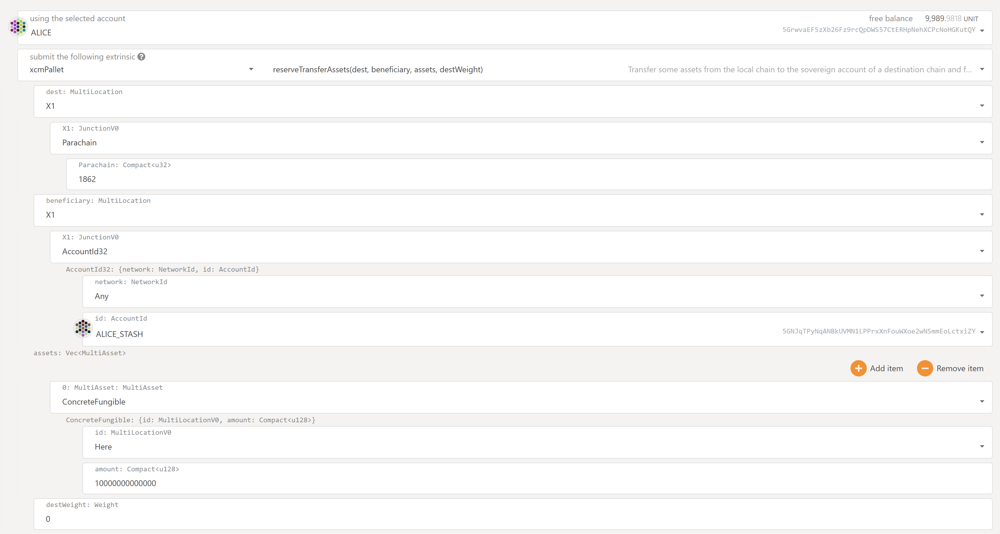

# Upward/ Downward native-token transfers
Working example for `polkadot-v0.9.12` to transfer the native token from the relay-chain to the parachain
 via the `xcm-pallet`. The message format is very generic, hence the correct extrinsics for those transfers are shown below.

Before we can send xcm-messages between the relay chain, we must overwrite the xcm-version. Polkadot defaults to version
two, which is not yet supported by the `Cumulus` template. This is a sudo call.
We can either set it globally with `forceDefaultXcmVersion` or only for a certain parachain with `forceXcmVersion`.

* `sudo.call(xcmPallet.forceDefaultXcmVersion(Some(1)))`
* `sudo.call(xcmPallet.forceXcmVersion(1862, 1))`

## Downwards Tx
Send from Alice on the relay chain to AliceStash on the parachain.

## Upwards Token Tx
Send from AliceStash on the parachain to AliceStash on the relay chain.

Note: This only works if there has been a `ReserveAssetTransfer` from the relay chain to the parachain before, which will
put some relay-chain tokens into the reserve allocated to the encointer-parachains asset register.

# Related Resources
* Shawn Tabrizi's XCM [workshop](https://www.youtube.com/watch?v=5cgq5jOZx9g&list=PLp0_ueXY_enX6S5sogeo7GHD1BXTLj5Xr&index=20) 
  at sub0 and the corresponding [resources](https://www.shawntabrizi.com/xcm-workshop/#/reserve-transfer).
