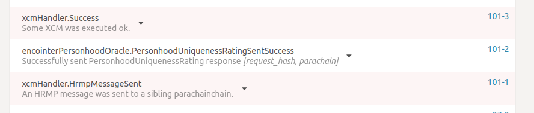
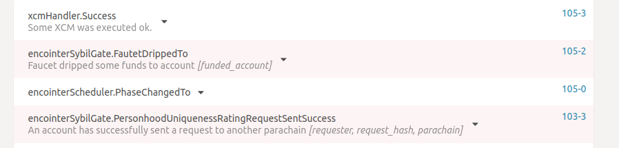
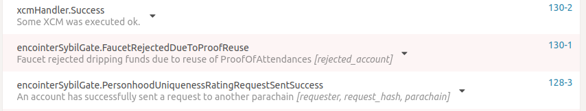

# Sybil Gate Demo
Encointer parachain features sybil-defense mechanisms by providing a `personhood-oracle`, which returns a rating of an account's personhood uniqueness. This personhood uniqueness rating is based on the attendance of the regular encointer ceremonies.

The encointer parachain also features a `sybil-gate-template`, which shows how to interact with the `personhood-oracle` from another parachain. This section explains the interaction of the `sybil-gate-template` with the `personhood-oracle` via the polkadot-ui. It is a little bit involved, hence we will provide a docker container soon.

* Launch the network with polkadot-launch as explained in the previous section.
* Run the `bootstrap_demo_community.py` from the encointer-node repository.
* After the script has finished, run the following command in the encointer-node repository, which will return a hex-encoded proof of attendance for Alice: `./target/release/encointer-client-notee get-proof-of-attendance --cid 41eSfKJrhrR6CYxPfUbwAN18R77WbxXoViRWQMAF4hJB //Alice -1`

This was the preliminaries. Now we head to the polkadot-ui to perform the xcm. We open three tabs in the browser with the polkadot-ui.

The first one should be connected to port `9988`, which is the rococo relay chain. There we can check whether the parachains have successfully connected to the relay chain and if they are producing blocks.

The second and third tab should be connected to port `9944` and `9955`, which are the ports of the two parachains with `para_id` = `1862` and `1863` respectively.

In parachain `1863` we go to extrinsics, choose the `encointer-sybil-template` pallet and send our request to the `personhood-oracle` of the other parachain. If successful, we should see a `PersonhoodUniquenessRatingRequestSentSuccess` event in the explorer.

Note: `pallet_personhood_oracle_index` is the pallet's module index in the encointer-parachain runtime. It is currently hardcoded to 14.

In the other tab connected to parachain `1862` we don't need to do anything, but we can observe in the explorer if the request has been handled successfully by our `personhood-oracle`.

Shortly after the request was handled successfully by the other parachain, we should see the following events thrown by parachain `1862`.

Doing the same again, will result in a failure, as each account can be funded only once.

