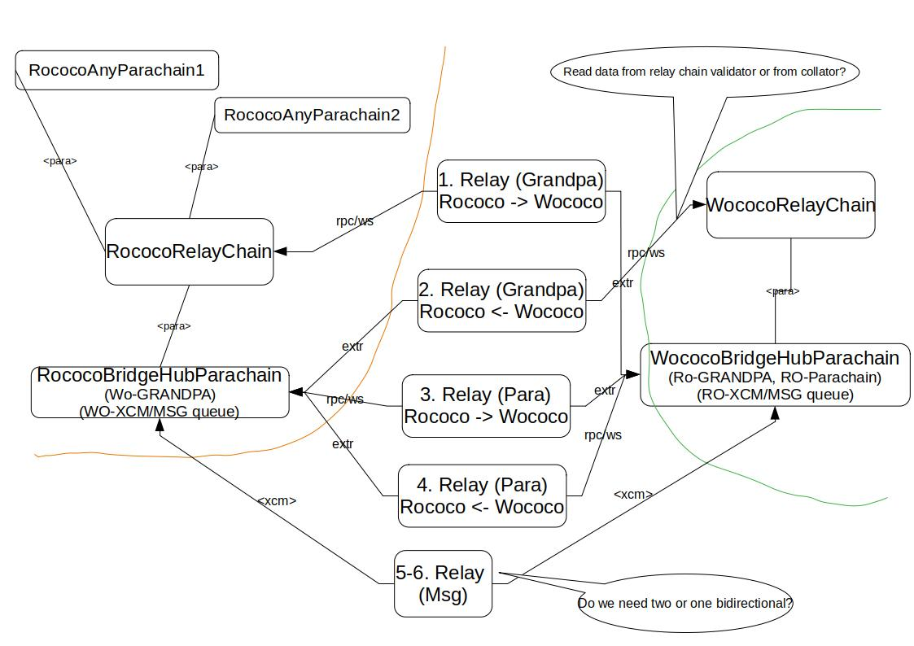

- [Bridge-hub Parachains](#bridge-hub-parachains)
	* [Requirements for local run/testing](#requirements-for-local-run-testing)
	* [How to test locally Rococo <-> Wococo bridge](#how-to-test-locally-rococo-----wococo-bridge)
		+ [Run chains (Rococo + BridgeHub, Wococo + BridgeHub) with zombienet](#run-chains--rococo---bridgehub--wococo---bridgehub--with-zombienet)
		+ [Run relayer (BridgeHubRococo, BridgeHubWococo)](#run-relayer--bridgehubrococo--bridgehubwococo-)
			- [Run with script (alternative 1)](#run-with-script--alternative-1-)
			- [Run with binary (alternative 2)](#run-with-binary--alternative-2-)
		+ [Send messages](#send-messages)
			- [Local zombienet run](#local-zombienet-run)
			- [Live Rockmine2 to Wockmint](#live-rockmine2-to-wockmint)
	* [How to test local BridgeHubKusama](#how-to-test-local-bridgehubkusama)
	* [How to test local BridgeHubPolkadot](#how-to-test-local-bridgehubpolkadot)

# Bridge-hub Parachains

_BridgeHub(s)_ are **_system parachains_** that will house trustless bridges from the local
ecosystem to others.
The current trustless bridges planned for the BridgeHub(s) are:
- `BridgeHubPolkadot` system parachain:
	1. Polkadot <-> Kusama bridge
	2. Polkadot <-> Ethereum bridge (Snowbridge)
- `BridgeHubKusama` system parachain:
	1. Kusama <-> Polkadot bridge
	2. Kusama <-> Ethereum bridge
	   The high-level responsibilities of each bridge living on BridgeHub:
- sync finality proofs between relay chains (or equivalent)
- sync finality proofs between BridgeHub parachains
- pass (XCM) messages between different BridgeHub parachains



## Requirements for local run/testing

```
# Prepare empty directory for testing
mkdir -p ~/local_bridge_testing/bin
mkdir -p ~/local_bridge_testing/logs

---
# 1. Install zombienet
Go to: https://github.com/paritytech/zombienet/releases
Copy the apropriate binary (zombienet-linux) from the latest release to ~/local_bridge_testing/bin


---
# 2. Build polkadot binary
git clone https://github.com/paritytech/polkadot.git
cd polkadot

# if you want to test Kusama/Polkadot bridge, we need "sudo pallet + fast-runtime",
# so please, find the latest polkadot's repository branch `it/release-vX.Y.Z-fast-sudo`
# e.g:
# git checkout -b it/release-v0.9.42-fast-sudo --track origin/it/release-v0.9.42-fast-sudo

cargo build --release --features fast-runtime
cp target/release/polkadot ~/local_bridge_testing/bin/polkadot


---
# 3. Build substrate-relay binary
git clone https://github.com/paritytech/parity-bridges-common.git
cd parity-bridges-common

# checkout desired branch or use master:
# git checkout -b master --track origin/master
# `polkadot-staging` (recommended) is stabilized and compatible for Cumulus releases
# `master` is latest development
git checkout -b polkadot-staging --track origin/polkadot-staging

cargo build --release -p substrate-relay
cp target/release/substrate-relay ~/local_bridge_testing/bin/substrate-relay


---
# 4. Build cumulus polkadot-parachain binary
cd <cumulus-git-repo-dir>

# checkout desired branch or use master:
# git checkout -b master --track origin/master

# !!! READ HERE (TODO remove once merged)
# The use case "moving assets over bridge" is not merged yet and is implemented in separate branches.
# So, if you want to try it, you need to checkout different branch and continue with these instructions there.
#
# For Kusama/Polkadot local bridge testing:
# git checkout -b bko-transfer-asset-via-bridge --track origin/bko-transfer-asset-via-bridge
#
# For Rococo/Wococo local/onchain bridge testing:
# git checkout -b bko-transfer-asset-via-bridge-ro-wo --track origin/bko-transfer-asset-via-bridge-ro-wo

cargo build --release --locked --bin polkadot-parachain
cp target/release/polkadot-parachain ~/local_bridge_testing/bin/polkadot-parachain
cp target/release/polkadot-parachain ~/local_bridge_testing/bin/polkadot-parachain-asset-hub
```

## How to test locally Rococo <-> Wococo bridge

### Run chains (Rococo + BridgeHub, Wococo + BridgeHub) with zombienet

```
# Rococo + BridgeHubRococo + AssetHub for Rococo (mirroring Kusama)
POLKADOT_BINARY_PATH=~/local_bridge_testing/bin/polkadot \
POLKADOT_PARACHAIN_BINARY_PATH=~/local_bridge_testing/bin/polkadot-parachain \
POLKADOT_PARACHAIN_BINARY_PATH_FOR_ASSET_HUB_ROCOCO=~/local_bridge_testing/bin/polkadot-parachain-asset-hub \
	~/local_bridge_testing/bin/zombienet-linux --provider native spawn ./zombienet/bridge-hubs/bridge_hub_rococo_local_network.toml
```

```
# Wococo + BridgeHubWococo + AssetHub for Wococo (mirroring Polkadot)
POLKADOT_BINARY_PATH=~/local_bridge_testing/bin/polkadot \
POLKADOT_PARACHAIN_BINARY_PATH=~/local_bridge_testing/bin/polkadot-parachain \
POLKADOT_PARACHAIN_BINARY_PATH_FOR_ASSET_HUB_WOCOCO=~/local_bridge_testing/bin/polkadot-parachain-asset-hub \
	~/local_bridge_testing/bin/zombienet-linux --provider native spawn ./zombienet/bridge-hubs/bridge_hub_wococo_local_network.toml
```

### Run relayer (BridgeHubRococo, BridgeHubWococo)

**Accounts of BridgeHub parachains:**
- `Bob` is pallet owner of all bridge pallets

#### Run with script (alternative 1)
```
cd <cumulus-git-repo-dir>
./scripts/bridges_rococo_wococo.sh run-relay
```

#### Run with binary (alternative 2)
Need to wait for parachain activation (start producing blocks), then run:

```
# 1. Init bridges:

# Rococo -> Wococo
RUST_LOG=runtime=trace,rpc=trace,bridge=trace \
	~/local_bridge_testing/bin/substrate-relay init-bridge rococo-to-bridge-hub-wococo \
	--source-host localhost \
	--source-port 9942 \
	--source-version-mode Auto \
	--target-host localhost \
	--target-port 8945 \
	--target-version-mode Auto \
	--target-signer //Bob

# Wococo -> Rococo
RUST_LOG=runtime=trace,rpc=trace,bridge=trace \
	~/local_bridge_testing/bin/substrate-relay init-bridge wococo-to-bridge-hub-rococo \
	--source-host localhost \
	--source-port 9945 \
	--source-version-mode Auto \
	--target-host localhost \
	--target-port 8943 \
	--target-version-mode Auto \
	--target-signer //Bob

# 2. Relay relay-chain headers, parachain headers and messages**
RUST_LOG=runtime=trace,rpc=trace,bridge=trace \
    ~/local_bridge_testing/bin/substrate-relay relay-headers-and-messages bridge-hub-rococo-bridge-hub-wococo \
    --rococo-host localhost \
    --rococo-port 9942 \
    --rococo-version-mode Auto \
    --bridge-hub-rococo-host localhost \
    --bridge-hub-rococo-port 8943 \
    --bridge-hub-rococo-version-mode Auto \
    --bridge-hub-rococo-signer //Charlie \
    --wococo-headers-to-bridge-hub-rococo-signer //Bob \
    --wococo-parachains-to-bridge-hub-rococo-signer //Bob \
    --bridge-hub-rococo-transactions-mortality 4 \
    --wococo-host localhost \
    --wococo-port 9945 \
    --wococo-version-mode Auto \
    --bridge-hub-wococo-host localhost \
    --bridge-hub-wococo-port 8945 \
    --bridge-hub-wococo-version-mode Auto \
    --bridge-hub-wococo-signer //Charlie \
    --rococo-headers-to-bridge-hub-wococo-signer //Bob \
    --rococo-parachains-to-bridge-hub-wococo-signer //Bob \
    --bridge-hub-wococo-transactions-mortality 4 \
    --lane 00000001
```

**Check relay-chain headers relaying:**
- Rococo parachain:
	- https://polkadot.js.org/apps/?rpc=ws%3A%2F%2F127.0.0.1%3A8943#/chainstate
	- Pallet: **bridgeWococoGrandpa**
	- Keys: **bestFinalized()**
- Wococo parachain:
	- https://polkadot.js.org/apps/?rpc=ws%3A%2F%2F127.0.0.1%3A8945#/chainstate
	- Pallet: **bridgeRococoGrandpa**
	- Keys: **bestFinalized()**

**Check parachain headers relaying:**
- Rococo parachain:
	- https://polkadot.js.org/apps/?rpc=ws%3A%2F%2F127.0.0.1%3A8943#/chainstate
	- Pallet: **bridgeWococoParachain**
	- Keys: **bestParaHeads()**
- Wococo parachain:
	- https://polkadot.js.org/apps/?rpc=ws%3A%2F%2F127.0.0.1%3A8945#/chainstate
	- Pallet: **bridgeRococoParachain**
	- Keys: **bestParaHeads()**

### Send messages - transfer asset over bridge

TODO: see `# !!! READ HERE` above

## How to test local BridgeHubKusama/BridgeHubPolkadot

TODO: see `# !!! READ HERE` above
