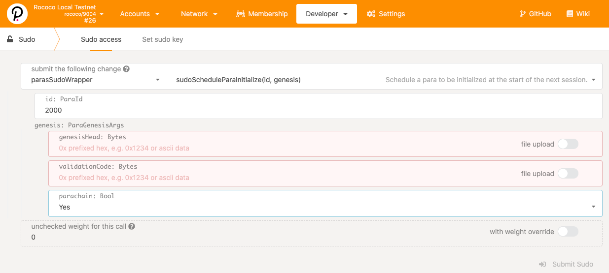

# Substrate Cumulus Parachain Template

A new [Cumulus](https://github.com/paritytech/cumulus/)-based Substrate node, ready for hacking :cloud:

This project is a fork of the
[Substrate Node Template](https://github.com/substrate-developer-hub/substrate-node-template)
modified to include dependencies required for registering this node as a **parathread** or
**parachain** to an established **relay chain**.

👉 Learn more about parachains [here](https://wiki.polkadot.network/docs/learn-parachains), and
parathreads [here](https://wiki.polkadot.network/docs/learn-parathreads).

## Build & Run

Follow these steps to prepare a local Substrate development environment :hammer_and_wrench:

### Setup of Machine

If necessary, refer to the setup instructions at the
[Substrate Developer Hub](https://substrate.dev/docs/en/knowledgebase/getting-started/#manual-installation).

### Build

Once the development environment is set up, build the Cumulus Parachain Template. This command will
build the
[Wasm Runtime](https://substrate.dev/docs/en/knowledgebase/advanced/executor#wasm-execution) and
[native](https://substrate.dev/docs/en/knowledgebase/advanced/executor#native-execution) code:

```bash
cargo build --release
```

## Relay Chain

> **NOTE**: In the following two sections, we document how to manually start a few relay chain
> nodes, start a parachain node (collator), and register the parachain with the relay chain.
>
> We also have the [**`polkadot-launch`**](https://www.npmjs.com/package/polkadot-launch) CLI tool
> that automate the following steps and help you easily launch relay chains and parachains. However
> it is still good to go through the following procedures once to understand the mechanism for running
> and registering a parachain.

To operate a parathread or parachain, you _must_ connect to a relay chain. Typically you would test
on a local Rococo development network, then move to the testnet, and finally launch on the mainnet.
**Keep in mind you need to configure the specific relay chain you will connect to in your collator
`chain_spec.rs`**. In the following examples, we will use `rococo-local` as the relay network.

### Build Relay Chain

Clone and build [Polkadot](https://github.com/paritytech/polkadot) (beware of the version tag we used):

```bash
# Get a fresh clone, or `cd` to where you have polkadot already:
git clone -b v0.9.7 --depth 1 https://github.com/paritytech/polkadot.git
cd polkadot
cargo build --release
```

### Generate the Relay Chain Chainspec

First, we create the chain specification file (chainspec). Note the chainspec file _must_ be generated on a
_single node_ and then shared among all nodes!

👉 Learn more about chain specification [here](https://substrate.dev/docs/en/knowledgebase/integrate/chain-spec).

```bash
./target/release/polkadot build-spec \
--chain rococo-local \
--raw \
--disable-default-bootnode \
> rococo_local.json
```

### Start Relay Chain

We need *n + 1* full _validator_ nodes running on a relay chain to accept *n* parachain / parathread
connections. Here we will start two relay chain nodes so we can have one parachain node connecting in
later.

From the Polkadot working directory:

```bash
# Start Relay `Alice` node
./target/release/polkadot \
--chain ./rococo_local.json \
-d /tmp/relay/alice \
--validator \
--alice \
--port 50555
```

Open a new terminal, same directory:

```bash
# Start Relay `Bob` node
./target/release/polkadot \
--chain ./rococo_local.json \
-d /tmp/relay/bob \
--validator \
--bob \
--port 50556
```

Add more nodes as needed, with non-conflicting ports, DB directories, and validator keys
(`--charlie`, `--dave`, etc.).

### Reserve a ParaID

To connect to a relay chain, you must first _reserve a `ParaId` for your parathread that will
become a parachain. To do this, you will need sufficient amount of currency on the network account
to reserve the ID.

In this example, we will use **`Charlie` development account** where we have funds available.
Once you submit this extrinsic successfully, you can start your collators.

The easiest way to reserve your `ParaId` is via
[Polkadot Apps UI](https://polkadot.js.org/apps/?rpc=ws%3A%2F%2F127.0.0.1%3A9944#/parachains/parathreads)
under the `Parachains` -> `Parathreads` tab and use the `+ ParaID` button.

## Parachain

### Select the Correct Relay Chain

To operate your parachain, you need to specify the correct relay chain you will connect to in your
collator `chain_spec.rs`. Specifically you pass the command for the network you need in the
`Extensions` of your `ChainSpec::from_genesis()` [in the code](node/src/chain_spec.rs#78-81).

```rust
Extensions {
	relay_chain: "rococo-local".into(), // You MUST set this to the correct network!
	para_id: id.into(),
},
```

> You can choose from any pre-set runtime chainspec in the Polkadot repo, by referring to the
> `cli/src/command.rs` and `node/service/src/chain_spec.rs` files or generate your own and use
> that. See the [Cumulus Workshop](https://substrate.dev/cumulus-workshop/) for how.

In the following examples, we will use the `rococo-local` relay network we setup in the last section.

### Export the Parachain Genesis and Runtime

We first generate the **genesis state** and **genesis wasm** needed for the parachain registration.

```bash
# Build the parachain node (from it's top level dir)
cd substrate-parachain-template
cargo build --release

# Folder to store resource files needed for parachain registration
mkdir -p resources

# Build the chainspec
./target/release/parachain-collator build-spec \
--disable-default-bootnode > ./resources/template-local-plain.json

# Build the raw chainspec file
./target/release/parachain-collator build-spec \
--chain=./resources/template-local-plain.json \
--raw --disable-default-bootnode > ./resources/template-local-raw.json

# Export genesis state to `./resources`, using 2000 as the ParaId
./target/release/parachain-collator export-genesis-state --parachain-id 2000 > ./resources/para-2000-genesis

# Export the genesis wasm
./target/release/parachain-collator export-genesis-wasm > ./resources/para-2000-wasm
```

> **NOTE**: we have set the `para_ID` to be **2000** here. This _must_ be unique for all parathreads/chains
> on the relay chain you register with. You _must_ reserve this first on the relay chain for the
> testnet or mainnet.

### Start a Parachain Node (Collator)

From the parachain template working directory:

```bash
# NOTE: this command assumes the chain spec is in a directory named `polkadot`
# that is at the same level of the template working directory. Change as needed.
#
# It also assumes a ParaId of 2000. Change as needed.
./target/release/parachain-collator \
-d /tmp/parachain/alice \
--collator \
--alice \
--force-authoring \
--ws-port 9945 \
--parachain-id 2000 \
-- \
--execution wasm \
--chain ../polkadot/rococo_local.json
```

_Output:_

```bash
2021-05-30 16:57:39 Parachain Collator Template
2021-05-30 16:57:39 ✌️  version 3.0.0-acce183-x86_64-linux-gnu
2021-05-30 16:57:39 ❤️  by Anonymous, 2017-2021
2021-05-30 16:57:39 📋 Chain specification: Local Testnet
2021-05-30 16:57:39 🏷 Node name: Alice
2021-05-30 16:57:39 👤 Role: AUTHORITY
2021-05-30 16:57:39 💾 Database: RocksDb at /tmp/parachain/alice/chains/local_testnet/db
2021-05-30 16:57:39 ⛓  Native runtime: template-parachain-1 (template-parachain-0.tx1.au1)
2021-05-30 16:57:41 Parachain id: Id(2000)
2021-05-30 16:57:41 Parachain Account: 5Ec4AhPUwPeyTFyuhGuBbD224mY85LKLMSqSSo33JYWCazU4
2021-05-30 16:57:41 Parachain genesis state: 0x0000000000000000000000000000000000000000000000000000000000000000000a96f42b5cb798190e5f679bb16970905087a9a9fc612fb5ca6b982b85783c0d03170a2e7597b7b7e3d84c05391d139a62b157e78786d8c082f29dcf4c11131400
2021-05-30 16:57:41 Is collating: yes
2021-05-30 16:57:41 [Parachain] 🔨 Initializing Genesis block/state (state: 0x0a96…3c0d, header-hash: 0xd42b…f271)
2021-05-30 16:57:41 [Parachain] ⏱  Loaded block-time = 12s from block 0xd42bb78354bc21770e3f0930ed45c7377558d2d8e81ca4d457e573128aabf271
2021-05-30 16:57:43 [Relaychain] 🔨 Initializing Genesis block/state (state: 0xace1…1b62, header-hash: 0xfa68…cf58)
2021-05-30 16:57:43 [Relaychain] 👴 Loading GRANDPA authority set from genesis on what appears to be first startup.
2021-05-30 16:57:44 [Relaychain] ⏱  Loaded block-time = 6s from block 0xfa68f5abd2a80394b87c9bd07e0f4eee781b8c696d0a22c8e5ba38ae10e1cf58
2021-05-30 16:57:44 [Relaychain] 👶 Creating empty BABE epoch changes on what appears to be first startup.
2021-05-30 16:57:44 [Relaychain] 🏷 Local node identity is: 12D3KooWBjYK2W4dsBfsrFA9tZCStb5ogPb6STQqi2AK9awXfXyG
2021-05-30 16:57:44 [Relaychain] 📦 Highest known block at #0
2021-05-30 16:57:44 [Relaychain] 〽️ Prometheus server started at 127.0.0.1:9616
2021-05-30 16:57:44 [Relaychain] Listening for new connections on 127.0.0.1:9945.
2021-05-30 16:57:44 [Parachain] Using default protocol ID "sup" because none is configured in the chain specs
2021-05-30 16:57:44 [Parachain] 🏷 Local node identity is: 12D3KooWADBSC58of6ng2M29YTDkmWCGehHoUZhsy9LGkHgYscBw
2021-05-30 16:57:44 [Parachain] 📦 Highest known block at #0
2021-05-30 16:57:44 [Parachain] Unable to listen on 127.0.0.1:9945
2021-05-30 16:57:44 [Parachain] Unable to bind RPC server to 127.0.0.1:9945. Trying random port.
2021-05-30 16:57:44 [Parachain] Listening for new connections on 127.0.0.1:45141.
2021-05-30 16:57:45 [Relaychain] 🔍 Discovered new external address for our node: /ip4/192.168.42.204/tcp/30334/ws/p2p/12D3KooWBjYK2W4dsBfsrFA9tZCStb5ogPb6STQqi2AK9awXfXyG
2021-05-30 16:57:45 [Parachain] 🔍 Discovered new external address for our node: /ip4/192.168.42.204/tcp/30333/p2p/12D3KooWADBSC58of6ng2M29YTDkmWCGehHoUZhsy9LGkHgYscBw
2021-05-30 16:57:48 [Relaychain] ✨ Imported #8 (0xe60b…9b0a)
2021-05-30 16:57:49 [Relaychain] 💤 Idle (2 peers), best: #8 (0xe60b…9b0a), finalized #5 (0x1e6f…567c), ⬇ 4.5kiB/s ⬆ 2.2kiB/s
2021-05-30 16:57:49 [Parachain] 💤 Idle (0 peers), best: #0 (0xd42b…f271), finalized #0 (0xd42b…f271), ⬇ 2.0kiB/s ⬆ 1.7kiB/s
2021-05-30 16:57:54 [Relaychain] ✨ Imported #9 (0x1af9…c9be)
2021-05-30 16:57:54 [Relaychain] ✨ Imported #9 (0x6ed8…fdf6)
2021-05-30 16:57:54 [Relaychain] 💤 Idle (2 peers), best: #9 (0x1af9…c9be), finalized #6 (0x3319…69a2), ⬇ 1.8kiB/s ⬆ 0.5kiB/s
2021-05-30 16:57:54 [Parachain] 💤 Idle (0 peers), best: #0 (0xd42b…f271), finalized #0 (0xd42b…f271), ⬇ 0.2kiB/s ⬆ 0.2kiB/s
2021-05-30 16:57:59 [Relaychain] 💤 Idle (2 peers), best: #9 (0x1af9…c9be), finalized #7 (0x5b50…1e5b), ⬇ 0.6kiB/s ⬆ 0.4kiB/s
2021-05-30 16:57:59 [Parachain] 💤 Idle (0 peers), best: #0 (0xd42b…f271), finalized #0 (0xd42b…f271), ⬇ 0 ⬆ 0
2021-05-30 16:58:00 [Relaychain] ✨ Imported #10 (0xc9c9…1ca3)
```

You see messages are from both a relaychain node and a parachain node. This is because a relay chain
light client is also run next to the parachain collator.

### Parachain Registration

Now that you have two relay chain nodes, and a parachain node accompanied with a relay chain light
client running, the next step is to register the parachain in the relay chain with the following
steps (for detail, refer to the [Substrate Cumulus Worship](https://substrate.dev/cumulus-workshop/#/en/3-parachains/2-register)):

- Goto [Polkadot Apps UI](https://polkadot.js.org/apps/#/explorer), connecting to your relay chain.

- Execute a sudo extrinsic on the relay chain by going to `Developer` -> `sudo` page.

- Pick `paraSudoWrapper` -> `sudoScheduleParaInitialize(id, genesis)` as the extrinsic type,
shown below.

	

- Set the `id: ParaId` to 2,000 (or whatever ParaId you used above), and set the `parachain: Bool`
option to **Yes**.

- For the `genesisHead`, drag the genesis state file exported above, `para-2000-genesis`, in.

- For the `validationCode`, drag the genesis wasm file exported above, `para-2000-wasm`, in.

> **Note**: When registering to the public Rococo testnet, ensure you set a **unique** `paraId`
> larger than 1,000. Values below 1,000 are reserved _exclusively_ for system parachains.

### Restart the Parachain (Collator)

The collator node may need to be restarted to get it functioning as expected. After a
[new epoch](https://wiki.polkadot.network/docs/en/glossary#epoch) starts on the relay chain,
your parachain will come online. Once this happens, you should see the collator start
reporting _parachain_ blocks:

```bash
# Notice the relay epoch change! Only then do we start parachain collating!
#
2021-05-30 17:00:04 [Relaychain] 💤 Idle (2 peers), best: #30 (0xfc02…2a2a), finalized #28 (0x10ff…6539), ⬇ 1.0kiB/s ⬆ 0.3kiB/s
2021-05-30 17:00:04 [Parachain] 💤 Idle (0 peers), best: #0 (0xd42b…f271), finalized #0 (0xd42b…f271), ⬇ 0 ⬆ 0
2021-05-30 17:00:06 [Relaychain] 👶 New epoch 3 launching at block 0x68bc…0605 (block slot 270402601 >= start slot 270402601).
2021-05-30 17:00:06 [Relaychain] 👶 Next epoch starts at slot 270402611
2021-05-30 17:00:06 [Relaychain] ✨ Imported #31 (0x68bc…0605)
2021-05-30 17:00:06 [Parachain] Starting collation. relay_parent=0x68bcc93d24a31a2c89800a56c7a2b275fe9ca7bd63f829b64588ae0d99280605 at=0xd42bb78354bc21770e3f0930ed45c7377558d2d8e81ca4d457e573128aabf271
2021-05-30 17:00:06 [Parachain] 🙌 Starting consensus session on top of parent 0xd42bb78354bc21770e3f0930ed45c7377558d2d8e81ca4d457e573128aabf271
2021-05-30 17:00:06 [Parachain] 🎁 Prepared block for proposing at 1 [hash: 0xf6507812bf60bf53af1311f775aac03869be870df6b0406b2969784d0935cb92; parent_hash: 0xd42b…f271; extrinsics (2): [0x1bf5…1d76, 0x7c9b…4e23]]
2021-05-30 17:00:06 [Parachain] 🔖 Pre-sealed block for proposal at 1. Hash now 0x80fc151d7ccf228b802525022b6de257e42388ec7dc3c1dd7de491313650ccae, previously 0xf6507812bf60bf53af1311f775aac03869be870df6b0406b2969784d0935cb92.
2021-05-30 17:00:06 [Parachain] ✨ Imported #1 (0x80fc…ccae)
2021-05-30 17:00:06 [Parachain] Produced proof-of-validity candidate. block_hash=0x80fc151d7ccf228b802525022b6de257e42388ec7dc3c1dd7de491313650ccae
2021-05-30 17:00:09 [Relaychain] 💤 Idle (2 peers), best: #31 (0x68bc…0605), finalized #29 (0xa6fa…9e16), ⬇ 1.2kiB/s ⬆ 129.9kiB/s
2021-05-30 17:00:09 [Parachain] 💤 Idle (0 peers), best: #0 (0xd42b…f271), finalized #0 (0xd42b…f271), ⬇ 0 ⬆ 0
2021-05-30 17:00:12 [Relaychain] ✨ Imported #32 (0x5e92…ba30)
2021-05-30 17:00:12 [Relaychain] Moving approval window from session 0..=2 to 0..=3
2021-05-30 17:00:12 [Relaychain] ✨ Imported #32 (0x8144…74eb)
2021-05-30 17:00:14 [Relaychain] 💤 Idle (2 peers), best: #32 (0x5e92…ba30), finalized #29 (0xa6fa…9e16), ⬇ 1.4kiB/s ⬆ 0.2kiB/s
2021-05-30 17:00:14 [Parachain] 💤 Idle (0 peers), best: #0 (0xd42b…f271), finalized #0 (0xd42b…f271), ⬇ 0 ⬆ 0
2021-05-30 17:00:18 [Relaychain] ✨ Imported #33 (0x8c30…9ccd)
2021-05-30 17:00:18 [Parachain] Starting collation. relay_parent=0x8c30ce9e6e9867824eb2aff40148ac1ed64cf464f51c5f2574013b44b20f9ccd at=0x80fc151d7ccf228b802525022b6de257e42388ec7dc3c1dd7de491313650ccae
2021-05-30 17:00:19 [Relaychain] 💤 Idle (2 peers), best: #33 (0x8c30…9ccd), finalized #30 (0xfc02…2a2a), ⬇ 0.7kiB/s ⬆ 0.4kiB/s
2021-05-30 17:00:19 [Parachain] 💤 Idle (0 peers), best: #1 (0x80fc…ccae), finalized #0 (0xd42b…f271), ⬇ 0 ⬆ 0
2021-05-30 17:00:22 [Relaychain] 👴 Applying authority set change scheduled at block #31
2021-05-30 17:00:22 [Relaychain] 👴 Applying GRANDPA set change to new set [(Public(88dc3417d5058ec4b4503e0c12ea1a0a89be200fe98922423d4334014fa6b0ee (5FA9nQDV...)), 1), (Public(d17c2d7823ebf260fd138f2d7e27d114c0145d968b5ff5006125f2414fadae69 (5GoNkf6W...)), 1)]
2021-05-30 17:00:22 [Relaychain] 👴 Imported justification for block #31 that triggers command Changing authorities, signaling voter.
2021-05-30 17:00:24 [Relaychain] ✨ Imported #34 (0x211b…febf)
2021-05-30 17:00:24 [Parachain] Starting collation. relay_parent=0x211b3c53bebeff8af05e8f283d59fe171b7f91a5bf9c4669d88943f5a42bfebf at=0x80fc151d7ccf228b802525022b6de257e42388ec7dc3c1dd7de491313650ccae
2021-05-30 17:00:24 [Parachain] 🙌 Starting consensus session on top of parent 0x80fc151d7ccf228b802525022b6de257e42388ec7dc3c1dd7de491313650ccae
2021-05-30 17:00:24 [Parachain] 🎁 Prepared block for proposing at 2 [hash: 0x10fcb3180e966729c842d1b0c4d8d2c4028cfa8bef02b909af5ef787e6a6a694; parent_hash: 0x80fc…ccae; extrinsics (2): [0x4a6c…1fc6, 0x6b84…7cea]]
2021-05-30 17:00:24 [Parachain] 🔖 Pre-sealed block for proposal at 2. Hash now 0x5087fd06b1b73d90cfc3ad175df8495b378fffbb02fea212cc9e49a00fd8b5a0, previously 0x10fcb3180e966729c842d1b0c4d8d2c4028cfa8bef02b909af5ef787e6a6a694.
2021-05-30 17:00:24 [Parachain] ✨ Imported #2 (0x5087…b5a0)
2021-05-30 17:00:24 [Parachain] Produced proof-of-validity candidate. block_hash=0x5087fd06b1b73d90cfc3ad175df8495b378fffbb02fea212cc9e49a00fd8b5a0
2021-05-30 17:00:24 [Relaychain] 💤 Idle (2 peers), best: #34 (0x211b…febf), finalized #31 (0x68bc…0605), ⬇ 1.0kiB/s ⬆ 130.1kiB/s
2021-05-30 17:00:24 [Parachain] 💤 Idle (0 peers), best: #1 (0x80fc…ccae), finalized #0 (0xd42b…f271), ⬇ 0 ⬆ 0
2021-05-30 17:00:29 [Relaychain] 💤 Idle (2 peers), best: #34 (0x211b…febf), finalized #32 (0x5e92…ba30), ⬇ 0.2kiB/s ⬆ 0.1kiB/s
2021-05-30 17:00:29 [Parachain] 💤 Idle (0 peers), best: #1 (0x80fc…ccae), finalized #0 (0xd42b…f271), ⬇ 0 ⬆ 0
2021-05-30 17:00:30 [Relaychain] ✨ Imported #35 (0xee07…38a0)
2021-05-30 17:00:34 [Relaychain] 💤 Idle (2 peers), best: #35 (0xee07…38a0), finalized #33 (0x8c30…9ccd), ⬇ 0.9kiB/s ⬆ 0.3kiB/s
2021-05-30 17:00:34 [Parachain] 💤 Idle (0 peers), best: #1 (0x80fc…ccae), finalized #1 (0x80fc…ccae), ⬇ 0 ⬆ 0
2021-05-30 17:00:36 [Relaychain] ✨ Imported #36 (0xe8ce…4af6)
2021-05-30 17:00:36 [Parachain] Starting collation. relay_parent=0xe8cec8015c0c7bf508bf3f2f82b1696e9cca078e814b0f6671f0b0d5dfe84af6 at=0x5087fd06b1b73d90cfc3ad175df8495b378fffbb02fea212cc9e49a00fd8b5a0
2021-05-30 17:00:39 [Relaychain] 💤 Idle (2 peers), best: #36 (0xe8ce…4af6), finalized #33 (0x8c30…9ccd), ⬇ 0.6kiB/s ⬆ 0.1kiB/s
2021-05-30 17:00:39 [Parachain] 💤 Idle (0 peers), best: #2 (0x5087…b5a0), finalized #1 (0x80fc…ccae), ⬇ 0 ⬆ 0
```

**Note the delay here!** It may take some time for your relay chain to enter a new epoch.

## Rococo & Westend Relay Chain Testnets

_Is this Cumulus Parachain Template Rococo & Westend testnets compatible?_ **Yes!**

- **Rococo** is the testnet of Kusama (join the
[Rococo Faucet](https://matrix.to/#/#rococo-faucet:matrix.org) to get testing funds).
- **Westend** is the testnet of Polkadot (join the
[Westend Faucet](https://matrix.to/#/#westend_faucet:matrix.org) to get testing funds).

See the [Cumulus Workshop](https://substrate.dev/cumulus-workshop/) for the latest instructions to
register a parathread/parachain on a relay chain.

> **NOTE**: When running the relay chain and parachain, you _must_ use the _same_ tagged version of
> [Polkadot](https://github.com/paritytech/polkadot) and [Cumulus](https://github.com/paritytech/cumulus)
> so the collator would register successfully to the relay chain.
> You should test locally registering your parachain successfully before attempting to connect to
> any running relay chain network!

Find `chainspec` files to connect to live networks [here](https://github.com/paritytech/polkadot/tree/master/node/service/res).
You want to be sure to use the correct git release tag in these files, as they change from time
to time and _must_ match the live network!

These networks are under _constant development_ - so please follow the progress and update of
your parachains in lock step with the testnet changes if you wish to connect to the network. Do
join the [Parachain Technical matrix chat room](https://app.element.io/#/room/#parachain-technical:matrix.parity.io)
to ask questions and connect with the parachain building teams.

## Learn More

- More detailed instructions to use Cumulus parachains are found in the
[Cumulus Workshop](https://substrate.dev/cumulus-workshop/#/en/3-parachains/2-register).
- Refer to the upstream [Substrate Node Template](https://github.com/substrate-developer-hub/substrate-node-template)
to learn more about the structure of this project, the capabilities it encapsulates and the way in
which those capabilities are implemented.
- Learn more about how a parachain block is added to a finalized chain [here](https://polkadot.network/the-path-of-a-parachain-block/).
