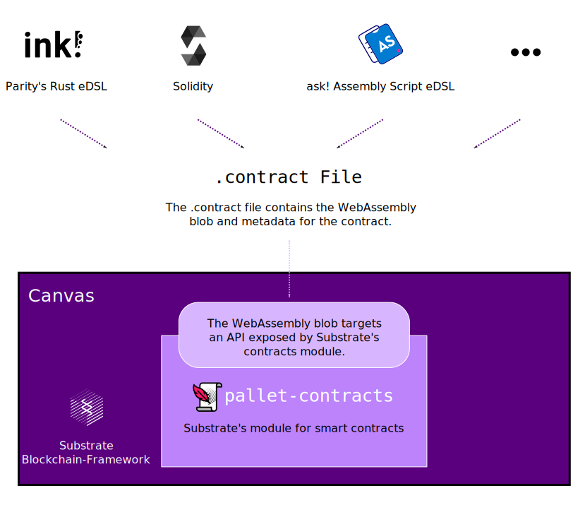

# Canvas ‒ A Smart Contracts Parachain

[![linux][a1]][a2] [![matrix][k1]][k2] [![discord][l1]][l2]

[a1]: https://gitlab.parity.io/parity/canvas/badges/master/pipeline.svg
[a2]: https://gitlab.parity.io/parity/canvas/pipelines?ref=master
[k1]: https://img.shields.io/badge/matrix-chat-brightgreen.svg?style=flat
[k2]: https://riot.im/app/#/room/#ink:matrix.parity.io
[l1]: https://img.shields.io/discord/722223075629727774?style=flat-square&label=discord
[l2]: https://discord.com/invite/wGUDt2p

This is a node implementation for Canvas, a [Substrate](https://github.com/paritytech/substrate)
parachain for smart contracts.

If you have any questions, feel free to talk to us on [Element][k2] or on [Discord][l2]
(in the [`ink_smart-contracts`](https://discord.com/channels/722223075629727774/765280480609828864) channel).

**Note:** This used to be a standalone smart contract node used for the ink! workshop. We
have moved the standalone node to [substrate-contracts-node](https://github.com/paritytech/substrate-contracts-node/).


## Developing Smart Contracts for Canvas

<div align="center">
    
</div>

This node is based on the
[`substrate-parachain-template`](https://github.com/substrate-developer-hub/substrate-parachain-template/),
which we configured to use Substrate's smart contract module ‒ the [`contracts`](https://github.com/paritytech/substrate/tree/master/frame/contracts)
pallet.
This `contracts` pallet takes smart contracts as WebAssembly blobs and defines an API
for everything a smart contract needs (storage access, …).
So as long as a programming language compiles to WebAssembly and there exists an implementation
of this API in it, you can write a smart contract for this pallet ‒ and thus for Canvas ‒ in
that language.

This is a list of smart contract languages you can currently choose from:

* [Parity's ink!](https://github.com/paritytech/ink) for Rust
* [ask!](https://github.com/patractlabs/ask) for Assembly Script
* [Solang](https://github.com/hyperledger-labs/solang) for Solidity

There are also different user interfaces and command-line tools you can use to deploy
or interact with contracts:

* [Canvas UI](https://paritytech.github.io/canvas-ui/)
* [polkadot-js](https://polkadot.js.org/apps/)

If you are looking for a quickstart we can recommend
[ink!'s Guided Tutorial for Beginners](https://substrate.dev/substrate-contracts-workshop/#/0/building-your-contract).


## Run it Locally

### Installation 

You need to have executables of both Polkadot and Canvas.

Binary releases can be found here:
[Polkadot releases](https://github.com/paritytech/polkadot/releases),
[Canvas releases](https://github.com/paritytech/canvas/releases).

Alternatively you can install (or build) the projects yourself:

* `cargo install --git https://github.com/paritytech/polkadot.git --force --locked`
* `cargo install --git https://github.com/paritytech/canvas.git --force --locked`

The `--locked` flag makes the installation (or build) use the same versions as the `Cargo.lock`
in those repositories ‒ ensuring that the last known-to-work version of the dependencies is used.

### Launching

Starting this project is best done using the [`polkadot-launch`](https://github.com/paritytech/polkadot-launch) tool ‒
it starts Polkadot and registers the Canvas parachain on it automatically.

To use `polkadot-launch` you must ensure that you're using Node.js `v14.x` or newer. If
you're on macOS, you must also ensure that your machine's firewall is disabled. You can
do this by going to "System Preferences" > "Security & Privacy" > "Firewall" and ensuring
that it's off.

Now that you have the prerequisites:
1. Install it with `yarn global add polkadot-launch` or `npm i polkadot-launch -g`
1. Check that the paths in `polkadot-launch/config.json` point to the `polkadot` and `canvas` executables
1. Launch the network with `polkadot-launch polkadot-launch/config.json`

At this point you should be able to use [Polkadot JS Apps](https://polkadot.js.org/apps/)
to connect to the Polkadot relay chain nodes as well as the Canvas collator.

## Building from source

Follow the [official installation steps](https://substrate.dev/docs/en/knowledgebase/getting-started/) 
to set up all Substrate prerequisites.

Afterwards you can install this node via

```bash
git clone https://github.com/paritytech/canvas.git 
cd canvas/
cargo build --release --locked 
```

### Substrate Compatibility

The latest confirmed working Substrate commit which will then be used is
[9b15da908a2e797e7960edac7011dd9d8b1106c6](https://github.com/paritytech/substrate/commit/9b15da908a2e797e7960edac7011dd9d8b1106c6).

### Unstable Features

If you're the type of person that likes to drink your soup before it cools, you might
also be wondering about how to activate unstable `pallet-contracts` features. To do this
you can run the previous installation command with the following flag: 
`--features contracts-unstable-interface`.
