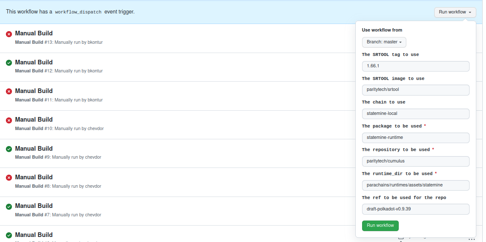
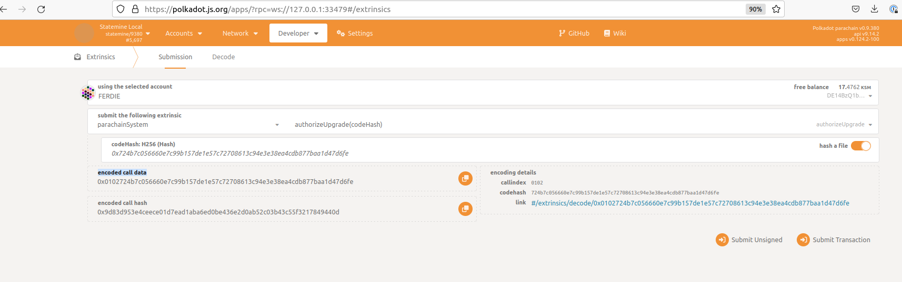
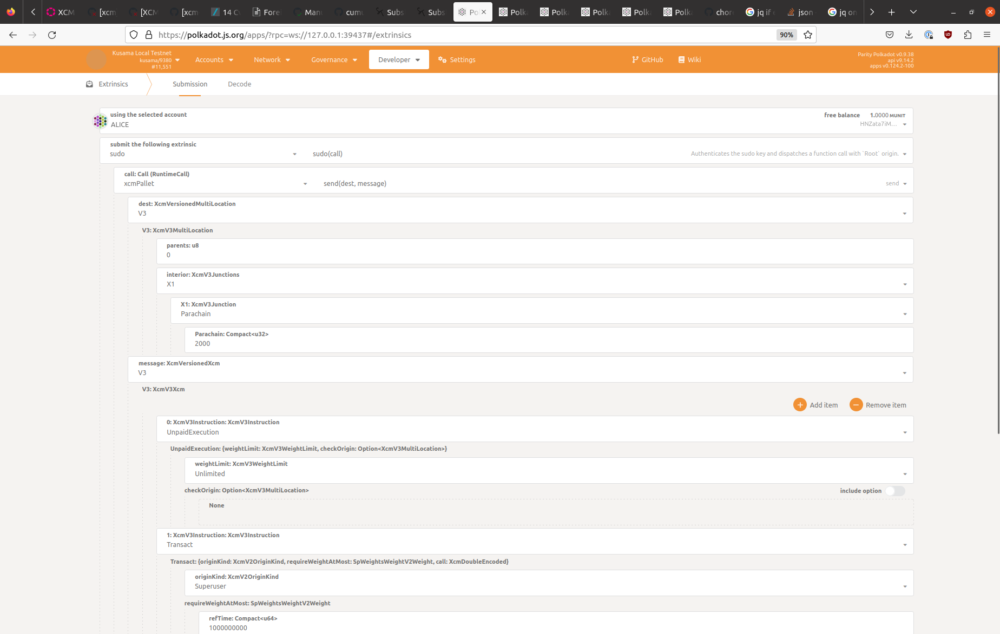
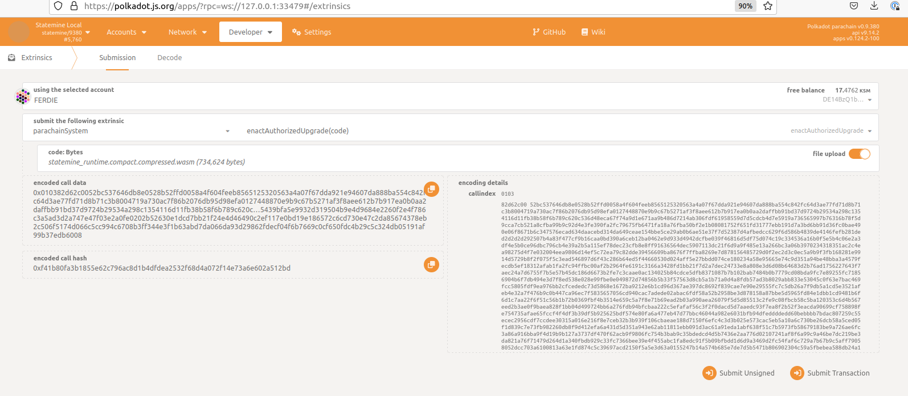

# Check if runtime upgrade works:

## 1. Build polkadot/kusama with sudo and fast-runtime:
```
# checkout https://github.com/paritytech/polkadot/tree/it/release-v0.9.38-fast-sudo
cargo build --release --features fast-runtime
cp ./target/release/polkadot ~/local_runtime_testing/bin/
```

## 2. Prepare runtimes to start with:

```
cd <cumulus-git-repo-dir>
# skip if, you already have binary
# cargo build --release -p polkadot-parachain-bin
```

or

```
Check docker image, e.g.: `paritypr/polkadot-parachain-debug:release-parachains-v9380-2a051cc6`
https://hub.docker.com/r/paritypr/polkadot-parachain-debug/tags
```

## 3. Prepare new runtimes for upgrade:

Either build your own wasm locally or use `srtool`:

Run manual build for some branch, e.g.: `draft-polkadot-v0.9.39` and `statemine-local` and download artifacts
https://github.com/paritytech/srtool/actions/workflows/manual.yml




## 4. Do test:

e.g: kusama-local + statemine-local

### 1. Starting parachains from local binary
```
cd <cumulus-git-repo-dir>

POLKADOT_BINARY_PATH=~/local_runtime_testing/bin/polkadot \
POLKADOT_PARACHAIN_IMAGE= \
POLKADOT_PARACHAIN_CMD=./target/release/polkadot-parachain \
RELAY_CHAIN=kusama-local \
PARA_CHAIN=statemine-local \
	~/local_runtime_testing/bin/zombienet-linux --provider native spawn ./zombienet/tests/manual/parachain-for-upgrade.toml
```

alternative: starting parachains from docker `paritypr/polkadot-parachain-debug:release-parachains-v9380-2a051cc6`
(TODO: does not work, need to check command or whatever)
```
cd <cumulus-git-repo-dir>

POLKADOT_BINARY_PATH=~/local_runtime_testing/bin/polkadot \
POLKADOT_PARACHAIN_IMAGE=paritypr/polkadot-parachain-debug:release-parachains-v9380-2a051cc6 \
POLKADOT_PARACHAIN_CMD= \
RELAY_CHAIN=kusama-local \
PARA_CHAIN=statemine-local \
	~/local_runtime_testing/bin/zombienet-linux --provider native spawn ./zombienet/tests/manual/parachain-for-upgrade.toml
```

### 2. Wait for parachain to start producing blocks:

### 3. Do some operations:

e.g.:

**Assets - create/mint:**
```
./zombienet/tests/manual/utils.sh create-asset ws://127.0.0.1:9910 HNZata7iMYWmk5RvZRTiAsSDhV8366zq2YGb3tLH5Upf74F //Alice
./zombienet/tests/manual/utils.sh mint-asset ws://127.0.0.1:9910 //Alice FoQJpPyadYccjavVdTWxpxU7rUEaYhfLCPwXgkfD6Zat9QP
```

**Uniques - create/mint/buy_nft:**
```
./zombienet/tests/manual/utils.sh create-unique ws://127.0.0.1:9910 HNZata7iMYWmk5RvZRTiAsSDhV8366zq2YGb3tLH5Upf74F //Alice
./zombienet/tests/manual/utils.sh mint-unique ws://127.0.0.1:9910 //Alice HNZata7iMYWmk5RvZRTiAsSDhV8366zq2YGb3tLH5Upf74F
./zombienet/tests/manual/utils.sh set-price-unique ws://127.0.0.1:9910 //Alice FoQJpPyadYccjavVdTWxpxU7rUEaYhfLCPwXgkfD6Zat9QP
./zombienet/tests/manual/utils.sh buy-unique ws://127.0.0.1:9910 //Bob
```


### 4. Store actual state:
**RuntimeVersion:**
```
./zombienet/tests/manual/utils.sh version ws://127.0.0.1:9910
{
  "lastRuntimeUpgrade": {
    "specVersion": "9,380",
    "specName": "statemine"
  }
}
```

**Account balances / Account assets:**
```
./zombienet/tests/manual/utils.sh data ws://127.0.0.1:9910 HNZata7iMYWmk5RvZRTiAsSDhV8366zq2YGb3tLH5Upf74F
./zombienet/tests/manual/utils.sh data ws://127.0.0.1:9910 FoQJpPyadYccjavVdTWxpxU7rUEaYhfLCPwXgkfD6Zat9QP
```


### 5. Do upgrade:

E.g.: From downloaded runtime from [3. Prepare new runtimes for upgrade:](#3-prepare-new-runtimes-for-upgrade-),
check: `statemine-local-info_compressed.json` -> `blake2_256`

**1. Prepare call on parachain chain:** https://polkadot.js.org/apps/?rpc=ws://127.0.0.1:9910#/extrinsics
```
parachainSystem::authorizeUpgrade(blake2_256) -> get `encoded call data`
```


**2. Make a call on relay chain:** https://polkadot.js.org/apps/?rpc=ws://127.0.0.1:9700#/extrinsics

You should see `parachainSystem.UpgradeAuthorized` event on parachain after success call.
Check also parachain's `chain_state: parachainSystem::authorizedUpgrade` - you should see a `blake2_256` here.


**3. Enact new wasm code on parachain:**

Check `parachainSystem.ValidationFunctionStored` and `parachainSystem.ValidationFunctionApplied` events.
Now you should see a new version and new blocks are still produced.




### 6. Check actual state:

Check state again [4. Store actual state](#4-store-actual-state-).


## Data sets:

**Statemine accounts:**

| Seed  |                    AccountId                    |
|-------|:-----------------------------------------------:|
| Alice | HNZata7iMYWmk5RvZRTiAsSDhV8366zq2YGb3tLH5Upf74F |
| Bob   | FoQJpPyadYccjavVdTWxpxU7rUEaYhfLCPwXgkfD6Zat9QP |
